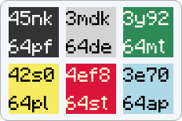
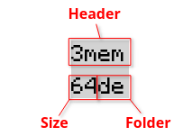

<p align="center">
    
</p>

<h1 align="center">Debug Theme for Breeze Icons</h1>

The theme makes it easy to quickly find the icons you want to replace.
KDE follows the latest [Icon Naming Specification](https://specifications.freedesktop.org/icon-naming-spec/latest/) but also adds a bunch of new icons.
Built upon the KDE 6 Breeze Icon theme, it replaces every single one, making it perfect for debugging and for creating your own icon theme from scratch that is compatible with KDE applications.

## Usage

### Icon Structure


* Header: Up to 4 symbols to uniquely identify an icon.
* Size: Icon size in pixels
* Folder: A short name for a [context folder](https://specifications.freedesktop.org/icon-naming-spec/latest/#context)

### Versions
There are three versions of the same theme, each with its own `icon_scheme.txt` that maps headers to icon paths.
* **Crisp (recommended):**
Generates all sizes from 16 to 256 pixels for each icon, ensuring the sharpest appearance.
* **Symlink:**
Preserves symlinks, which is particularly useful when creating your own icon theme, as it requires replacing fewer icons. KDE does not provide all sizes of the same icon and refers to one of them if the correct size is not found. The selected icon must be scaled up or down, which can make it harder to read.
* **Dark-Symlink:**
Same as Symlink but is built from Breeze Dark icon theme.

## Installation

### KDE 6
1. Unpack the folder and copy it to one of the following locations:

    ```
    ~/.local/share/icons/
    ```
    ```
    /usr/share/icons/
    ```
2. Navigate to **System Settings -> Colors & Themes -> Icons**
3. Select the debug theme and click **Apply**
4. Open `icon_scheme.txt` file in the theme folder

## License
This project is licensed under the [CC BY 4.0 License](https://creativecommons.org/licenses/by/4.0/)
